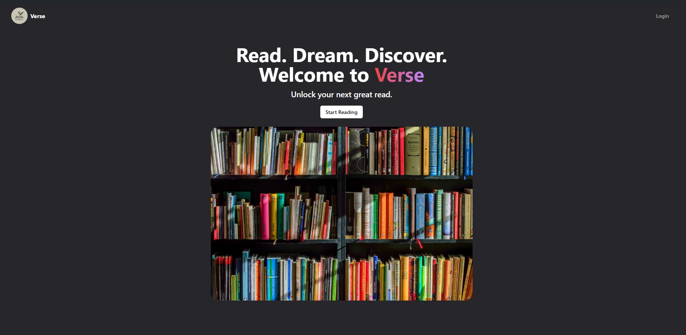

# Verse - Read Books Anywhere, Anytime.

## Introduction
 **Verse** is a platform that provides you with a wide range of books.  It is an open source project and we are continuously adding new books to the platform.

## Features

- **Read Books Anywhere, Anytime.**
- **Search for Books.**
- **Subscribe to Books.**
- **Rate Books.** and many more...

## Technologies used

- [React](https://reactjs.org/)
- [TypeScript](https://www.typescriptlang.org/)
- [Redux](https://redux.js.org/)
- [React-Redux](https://react-redux.js.org/)
- [React-Router-Dom](https://reactrouter.com/)
- [TailwindCSS](https://tailwindcss.com/)
- [React-Hook-Form](https://react-hook-form.com/)
- [Appwrite](https://appwrite.io/)
- [Prettier](https://prettier.io/)
- [Vite](https://vitejs.dev/)