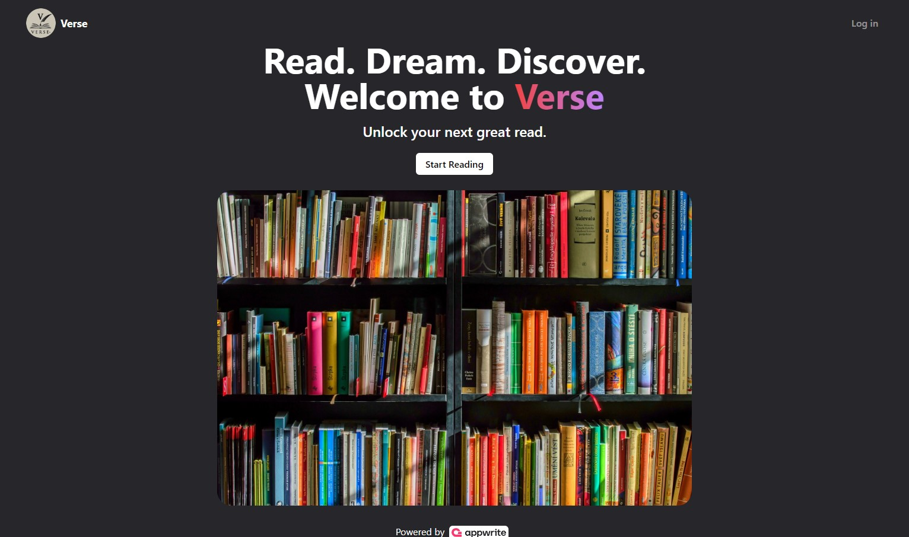

# Verse - Read Books Anywhere, Anytime.

Visit Here **[Verse](https://explore-verse.vercel.app/)**

## Introduction
  Love to read? **Verse** is your new book best friend! Find all your favorite books (and discover new ones!) right on your device. Read books right in the app, save them for later, or get recommendations on what to read next. Verse makes reading easy - subscribe to authors you love and never miss a new book again.

It is a platform that allows you to read books and we are continuously adding new books.

## Features

- **Read Books Anywhere, Anytime.**
- **Search for Books.**
- **Subscribe to Books.**
- **Rate Books.** and many more...

## Technologies used

- [React](https://reactjs.org/)
- [TypeScript](https://www.typescriptlang.org/)
- [Redux](https://redux.js.org/)
- [React-Redux](https://react-redux.js.org/)
- [React-Router-Dom](https://reactrouter.com/)
- [TailwindCSS](https://tailwindcss.com/)
- [React-Hook-Form](https://react-hook-form.com/)
- [Appwrite](https://appwrite.io/)
- [Prettier](https://prettier.io/)
- [Vite](https://vitejs.dev/)

## Help Shape the Future of Verse: Contribute to Our Book App!

Verse is a growing book app with a mission to make reading accessible and engaging for everyone. We're looking for passionate developers to join our team and contribute to both the frontend and backend of our web application.

## Hey devs, here's where you can make a difference:

### Frontend:
- Build beautiful and intuitive user interfaces using React.js and Tailwind CSS.
- Craft a seamless user experience leveraging Redux for state management.

### Backend:
- Develop robust backend APIs using your preferred language and framework.
- Implement user management features like authentication and authorization.
- Integrate avatar functionality for user personalization.
- Build functionalities for book subscriptions, like count display and management.
- Develop features for user interaction on books, like like counts and rating systems.

Whether you're a seasoned React developer or a backend enthusiast, your skills can help us take Verse to the next level.

### What We Offer:
- An opportunity to work on a project you'll be proud of.
- Collaboration with a talented and passionate team.
- The chance to shape the future of a rapidly growing app.
- A welcoming and inclusive open-source community.

Ready to join us?

We encourage developers of all skill levels to contribute. Check out our codebase on [GitHub](https://github.com/nil2022/bookshub) and jump in ! We have clear documentation and a supportive community to help you get started. Let's build a fantastic reading experience together.
